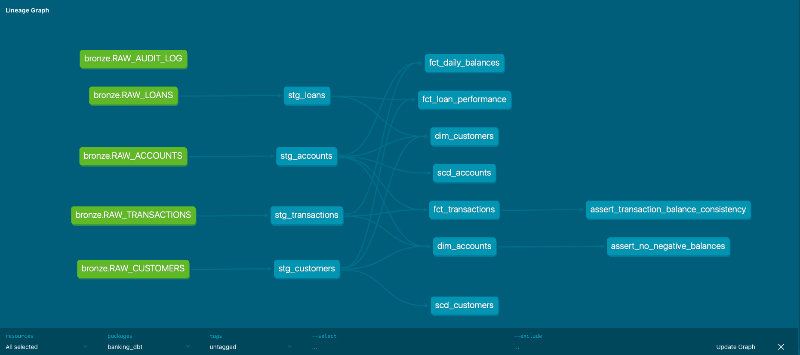
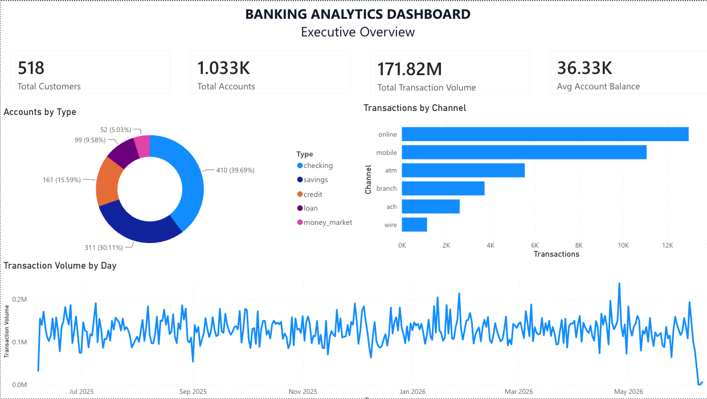
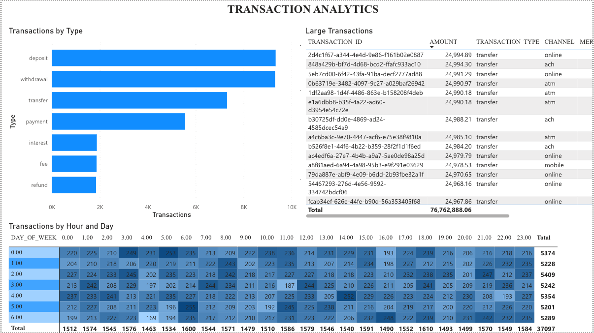
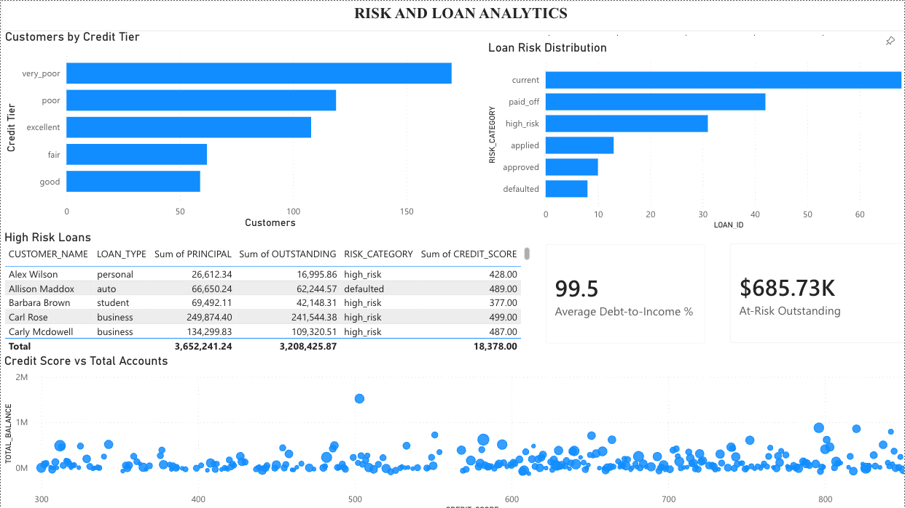
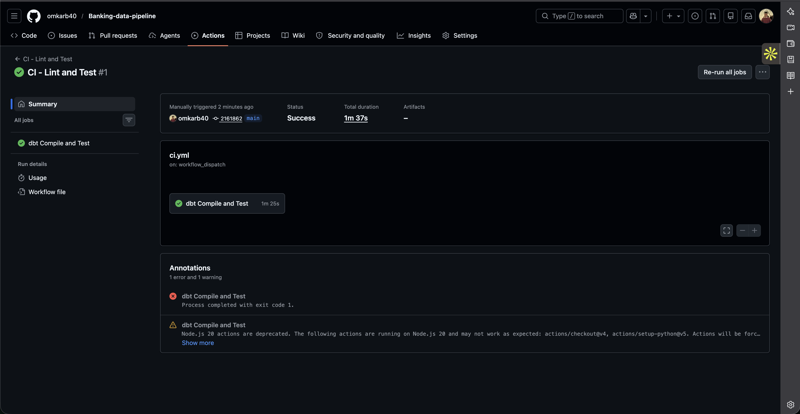

# Banking Modern Data Stack

A production-grade data engineering pipeline that mirrors how modern banking systems move data from transactional databases to analytics-ready warehouses in real time. Built end-to-end: PostgreSQL (OLTP) → Kafka + Debezium (CDC) → MinIO (Data Lake) → Airflow (Orchestration) → Snowflake (Warehouse) → dbt (Transformations) → Power BI (Dashboards), with CI/CD via GitHub Actions.

## Architecture

```
┌──────────────┐   CDC (WAL)  ┌────────────────┐  Stream  ┌──────────┐
│  PostgreSQL  │─────────────▶│  Kafka +       │─────────▶│  MinIO   │
│  (OLTP)      │   Debezium   │  Debezium      │          │  (S3)    │
└──────┬───────┘              └────────────────┘          └────┬─────┘
       │                                                       │
  Faker Generator                                    Airflow DAGs
  (seed + stream)                                   (batch FLATTEN)
                                                        │
                                                        ▼
                                                 ┌──────────────┐
                              ┌─── dbt ────────▶ │  Snowflake   │
                              │  (staging,       │  Bronze/Silve│
                              │   marts,         │  /Gold       │
                              │   SCD-2,         └──────┬───────┘
                              │   tests)                │
                              │                         ▼
                              │                 ┌──────────────┐
                              │                 │  Power BI    │
                              │                 │  (Dashboards)│
                              │                 └──────────────┘
                              │
                    ┌─────────┴──────────┐
                    │  GitHub Actions    │
                    │ CI: compile + test │
                    │ CD: deploy to prod │
                    └────────────────────┘
```

## Tech Stack

| Tool | Purpose |
|------|---------|
| PostgreSQL 15 | Source OLTP database with ACID guarantees |
| Apache Kafka + Debezium 2.4 | Real-time Change Data Capture via WAL |
| MinIO | S3-compatible data lake (raw CDC storage) |
| Apache Airflow 2.8 | Workflow orchestration and scheduling |
| Snowflake | Cloud data warehouse (Medallion Architecture) |
| dbt 1.7 | SQL transformations, SCD-2 snapshots, data quality tests |
| Power BI | Enterprise dashboards on Gold layer |
| Docker + Docker Compose | Containerized local infrastructure |
| GitHub Actions | CI/CD pipelines |

## Key Engineering Decisions

**Schema design beyond tutorials.** The OLTP layer has 6 tables (customers, accounts, transactions, loans, branches, audit_log) with PostgreSQL ENUMs, CHECK constraints, UUID primary keys, and trigger-based audit trails. Most CDC tutorials use 3 tables with VARCHAR status fields. The `audit_log` table auto-captures every customer change as JSONB via triggers, which Debezium then streams as its own CDC topic. This mirrors banking compliance requirements (SOX, PCI-DSS).

**Debezium NUMERIC decoding.** Debezium's JsonConverter (without schemas) base64-encodes PostgreSQL NUMERIC columns. Dates become days-since-epoch integers, timestamps become microsecond integers. I built a Snowflake JavaScript UDF (`DECODE_DEBEZIUM_NUMERIC`) to decode base64 byte arrays back to usable dollar amounts. This is a real production problem that most tutorials skip by using simpler data types.

**Batch insert optimization.** The initial Airflow DAG inserted records one at a time, opening a new Snowflake connection per row (3 seconds each, projecting to 11+ hours for the full dataset). I refactored to use Snowflake's `LATERAL FLATTEN(PARSE_JSON(...))` to insert entire JSON files in a single query. Loading time dropped from hours to minutes. The v1 → v2 comparison is documented in the DAG comments.

**Weighted data distributions.** The Faker generator uses configurable probability distributions (not uniform random) for transaction types, channels, merchant categories, and account types. This produces realistic-looking data: online/mobile channels dominate, deposits are larger than fees, credit card transactions skew toward specific merchant categories.

## Repository Structure

```
Banking-data-pipeline/
├── .github/workflows/
│   ├── ci.yml                    # Lint + test on PRs
│   └── cd.yml                    # Deploy on merge to main
├── banking-dbt/
│   ├── models/
│   │   ├── staging/              # Silver layer (Debezium decode)
│   │   │   ├── stg_customers.sql
│   │   │   ├── stg_accounts.sql
│   │   │   ├── stg_transactions.sql
│   │   │   ├── stg_loans.sql
│   │   │   └── staging.yml
│   │   ├── marts/                # Gold layer (business-ready)
│   │   │   ├── dim_customers.sql
│   │   │   ├── dim_accounts.sql
│   │   │   ├── fct_transactions.sql
│   │   │   ├── fct_daily_balances.sql
│   │   │   ├── fct_loan_performance.sql
│   │   │   └── marts.yml
│   │   └── sources.yml
│   ├── snapshots/                # SCD Type-2 history
│   │   ├── scd_customers.sql
│   │   └── scd_accounts.sql
│   ├── tests/                    # Custom data quality tests
│   └── dbt_project.yml
├── consumer/
│   └── kafka_to_minio.py        # Kafka → MinIO consumer
├── data/
│   ├── config.yaml              # Generation parameters
│   └── faker_generator.py       # Seed + stream modes
├── docker/
│   └── dags/
│       ├── minio_to_snowflake.py # Batch-optimized ingestion (v2)
│       └── run_dbt_snapshots.py  # dbt orchestration DAG
├── kafka-debezium/
│   └── register_connector.py    # Debezium connector lifecycle
├── postgres/
│   └── schema.sql               # OLTP DDL (6 tables, ENUMs, triggers)
├── snowflake/
│   ├── setup.sql                # Warehouse, schemas, roles, Bronze tables
│   └── udf_setup.sql           # Debezium NUMERIC decode UDF
├── docker-compose.yml           # Full infrastructure (phased)
├── dockerfile-airflow.dockerfile
└── requirements.txt
```

## Data Model

### OLTP (PostgreSQL)

**customers** — UUID PK, credit_score (300-850), annual_income, employment_status, risk_rating, home_branch_id FK

**accounts** — UUID PK, customer_id FK, account_type ENUM (checking/savings/credit/loan/money_market), balance, interest_rate, credit_limit, overdraft_limit, status ENUM

**transactions** — UUID PK, account_id FK, transaction_type ENUM, amount, balance_before, balance_after, channel ENUM, merchant_name, merchant_category, is_flagged, flag_reason

**loans** — UUID PK, account_id FK, customer_id FK, loan_type (personal/auto/mortgage/student/business/home_equity), principal, interest_rate, term_months, monthly_payment, total_paid, outstanding, status ENUM

**branches** — Serial PK, branch_code, 10 seeded locations including a digital-only branch

**audit_log** — Auto-populated via trigger, stores old/new row values as JSONB

### Warehouse (Snowflake — Medallion Architecture)

**Bronze** — Raw Debezium CDC payloads stored as VARIANT. One table per source entity.

**Silver** — Typed and deduplicated staging views. Debezium-specific decoding: base64 NUMERIC → UDF, epoch days → DATEADD, epoch microseconds → TO_TIMESTAMP. Incremental materialization with ROW_NUMBER deduplication.

**Gold** — Business-ready dimensions and facts:
- `dim_customers` — customer attributes + aggregated account/loan metrics, credit_tier, customer_segment
- `dim_accounts` — account details + transaction summary, credit_utilization_pct
- `fct_transactions` — one row per transaction, flow_direction, is_large_transaction, is_off_hours
- `fct_daily_balances` — daily aggregation per account (inflow, outflow, net_flow, closing_balance)
- `fct_loan_performance` — loan-level risk metrics (repayment_pct, debt_to_income_pct, risk_category)

### SCD Type-2 Snapshots

`scd_customers` and `scd_accounts` track historical changes with `dbt_valid_from` and `dbt_valid_to` columns. When a customer's credit_score changes or an account status flips to frozen, dbt creates a new row preserving the full history.

## dbt Lineage



## Dashboards

### Executive Overview


### Transaction Analytics


### Risk & Loans


## CI/CD



**CI (Pull Requests):** dbt compile → dbt run → dbt test against a CI_TEST schema

**CD (Merge to Main):** dbt snapshot → dbt run → dbt test against production schema

## Quick Start

### Prerequisites
- Docker Desktop
- Python 3.10+
- Snowflake account
- dbt (`pip install dbt-snowflake`)

### Phase 1: PostgreSQL + Data Generator
```bash
docker compose up postgres -d
pip install -r requirements.txt
cd data && python faker_generator.py --mode seed
```

### Phase 2: CDC Pipeline
```bash
docker compose up zookeeper kafka kafka-connect minio kafka-ui -d
cd kafka-debezium && python register_connector.py
cd ../data && python faker_generator.py --mode stream   # Terminal 1
cd ../consumer && python kafka_to_minio.py              # Terminal 2
```

### Phase 3: Snowflake
Run `snowflake/setup.sql` and `snowflake/udf_setup.sql` in Snowflake UI.

### Phase 4: Airflow
```bash
docker build -f dockerfile-airflow.dockerfile -t banking-airflow .
docker compose --profile airflow up -d
# Configure minio_s3 and snowflake_default connections in Airflow UI
# Trigger minio_to_snowflake_bronze DAG
```

### Phase 5: dbt
```bash
cd banking-dbt
dbt run --select staging
dbt snapshot
dbt run --select marts
dbt test
```

### Phase 6: CI/CD
Add `SNOWFLAKE_ACCOUNT`, `SNOWFLAKE_USER`, `SNOWFLAKE_PASSWORD` as GitHub Secrets.

## What I Would Do Differently in Production

- **Snowpipe** instead of Airflow for MinIO → Snowflake ingestion (event-driven, lower latency)
- **Terraform** for infrastructure-as-code (Snowflake resources, Kafka topics)
- **Great Expectations** or **Soda** for more comprehensive data quality monitoring
- **Debezium with Avro + Schema Registry** instead of raw JSON (schema evolution, smaller payloads)
- **Monitoring and alerting** via Datadog or Grafana on Kafka lag, Airflow task failures, dbt test results
- **Snowflake Streams + Tasks** as an alternative to dbt for near-real-time Silver/Gold layer updates
